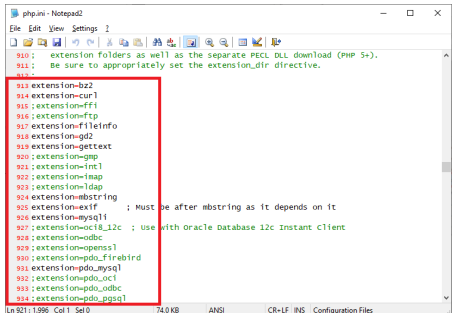

# PHP Framework (Codeigniter)

## Instruksi Praktikum

1. Persiapkan text editor misalnya `VSCode`.
2. Buat folder baru dengan nama `Artikel` pada docroot webserver (`htdocs`)
3. Ikuti langkah-langkah praktikum yang akan dijelaskan berikutnya.

## Langkah-langkah Praktikum

**Persiapan** 
Sebelum memulai menggunakan Framework Codeigniter, perlu dilakukan konfigurasi pada
webserver. Beberapa ekstensi PHP perlu diaktifkan untuk kebutuhan pengembangan
Codeigniter 4. 
 
Berikut beberapa ekstensi yang perlu diaktifkan: 
• `php-json` ekstension untuk bekerja dengan JSON; 
• `php-mysqlnd` native driver untuk MySQL; 
• `php-xml` ekstension untuk bekerja dengan XML; 
• `php-intl` ekstensi untuk membuat aplikasi multibahasa; 
• `libcurl` (opsional), jika ingin pakai Curl. 
 
Untuk mengaktifkan ekstentsi tersebut, melalu `XAMPP Control Panel`, pada bagian Apache
klik `Config`->`PHP.ini`
 
 
 
Pada bagian extention, hilangkan tanda ; (titik koma) pada ekstensi yang akan diaktifkan.
Kemudian simpan kembali filenya dan restart Apache web server. 
 
 
 

## Instalasi Codeigniter 4

Untuk melakukan instalasi Codeigniter 4 dapat dilakukan dengan dua cara, yaitu cara manual
dan menggunakan composer. Pada praktikum ini kita menggunakan cara manual. 
• Unduh `Codeigniter` dari website https://codeigniter.com/download  
• Extrak file zip Codeigniter ke direktori `htdocs/Artikel`. 
• Ubah nama direktory `framework-4.x.xx` menjadi `ci4`. 
• Buka browser dengan alamat http://localhost/Artikel/ci4/public/  
 

